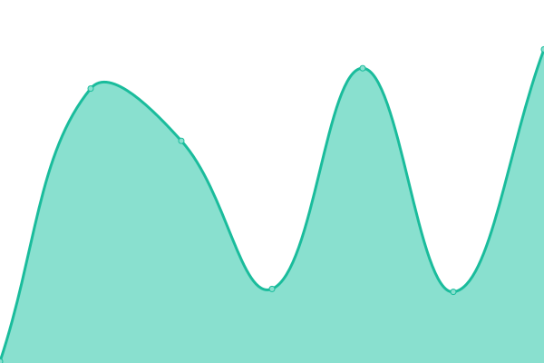

# [📈 Live Status](https://demo.upptime.js.org): <!--live status--> **🟩 All systems operational**

This repository contains the open-source uptime monitor and status page for [Upptime](https://upptime.js.org), powered by [Upptime](https://github.com/upptime/upptime).

With [Upptime](https://upptime.js.org), you can get your own unlimited and free uptime monitor and status page, powered entirely by a GitHub repository. We use [Issues](https://github.com/upptime/upptime/issues) as incident reports, [Actions](https://github.com/HaffMedia/Swiptly-Sites/actions) as uptime monitors, and [Pages](https://demo.upptime.js.org) for the status page.

<!--start: status pages-->
<!-- This summary is generated by Upptime (https://github.com/upptime/upptime) -->
<!-- Do not edit this manually, your changes will be overwritten -->
<!-- prettier-ignore -->
| URL | Status | History | Response Time | Uptime |
| --- | ------ | ------- | ------------- | ------ |
|  [Swiptly](https://swiptly.io) | 🟩 Up | [swiptly.yml](https://github.com/HaffMedia/Swiptly-Sites/commits/HEAD/history/swiptly.yml) | 

 864ms
     
 | 

<a href="https://monitor.swiptly.io/history/swiptly">100.00%</a>
    

|  [Scribe Associates](https://scribeassociatesltd.co.uk) | 🟩 Up | [scribe-associates.yml](https://github.com/HaffMedia/Swiptly-Sites/commits/HEAD/history/scribe-associates.yml) | 

 700ms
     
 | 

<a href="https://monitor.swiptly.io/history/scribe-associates">100.00%</a>
    

|  [GMLPF](https://gmlpf.net) | 🟩 Up | [gmlpf.yml](https://github.com/HaffMedia/Swiptly-Sites/commits/HEAD/history/gmlpf.yml) | 

 1431ms
     
 | 

<a href="https://monitor.swiptly.io/history/gmlpf">100.00%</a>
    

|  [Mode](https://modetraining.co.uk) | 🟩 Up | [mode.yml](https://github.com/HaffMedia/Swiptly-Sites/commits/HEAD/history/mode.yml) | 

 877ms
     
 | 

<a href="https://monitor.swiptly.io/history/mode">100.00%</a>
    

|  [The Child Care Academy](https://thechildcareacademy.co.uk) | 🟩 Up | [the-child-care-academy.yml](https://github.com/HaffMedia/Swiptly-Sites/commits/HEAD/history/the-child-care-academy.yml) | 

 774ms
     
 | 

<a href="https://monitor.swiptly.io/history/the-child-care-academy">100.00%</a>
    

|  [It's Fresh](https://itsfresh.com) | 🟩 Up | [it-s-fresh.yml](https://github.com/HaffMedia/Swiptly-Sites/commits/HEAD/history/it-s-fresh.yml) | 

 827ms
     
 | 

<a href="https://monitor.swiptly.io/history/it-s-fresh">100.00%</a>
    

|  [Towers Associates](https://towersassociates.co.uk) | 🟩 Up | [towers-associates.yml](https://github.com/HaffMedia/Swiptly-Sites/commits/HEAD/history/towers-associates.yml) | 

 310ms
     
 | 

<a href="https://monitor.swiptly.io/history/towers-associates">100.00%</a>
    

|  [Vitality Maestros](https://vitalitymaestros.com) | 🟩 Up | [vitality-maestros.yml](https://github.com/HaffMedia/Swiptly-Sites/commits/HEAD/history/vitality-maestros.yml) | 

 1180ms
     
 | 

<a href="https://monitor.swiptly.io/history/vitality-maestros">100.00%</a>
    

|  [We are the Property Maestros](https://wearethepropertymaestros.com) | 🟩 Up | [we-are-the-property-maestros.yml](https://github.com/HaffMedia/Swiptly-Sites/commits/HEAD/history/we-are-the-property-maestros.yml) | 

 1741ms
     
 | 

<a href="https://monitor.swiptly.io/history/we-are-the-property-maestros">100.00%</a>
    

|  [Grace Jukes](https://gracejukes.com) | 🟩 Up | [grace-jukes.yml](https://github.com/HaffMedia/Swiptly-Sites/commits/HEAD/history/grace-jukes.yml) | 

 1213ms
     
 | 

<a href="https://monitor.swiptly.io/history/grace-jukes">100.00%</a>
    

|  [Team Jukes](https://teamjukes.com) | 🟩 Up | [team-jukes.yml](https://github.com/HaffMedia/Swiptly-Sites/commits/HEAD/history/team-jukes.yml) | 

 1315ms
     
 | 

<a href="https://monitor.swiptly.io/history/team-jukes">100.00%</a>
    

|  [Go Local EPC](https://golocalepc.co.uk) | 🟩 Up | [go-local-epc.yml](https://github.com/HaffMedia/Swiptly-Sites/commits/HEAD/history/go-local-epc.yml) | 

 549ms
     
 | 

<a href="https://monitor.swiptly.io/history/go-local-epc">100.00%</a>
    

|  [TRS Training](https://trstrainingltd.com) | 🟩 Up | [trs-training.yml](https://github.com/HaffMedia/Swiptly-Sites/commits/HEAD/history/trs-training.yml) | 

 2531ms
     
 | 

<a href="https://monitor.swiptly.io/history/trs-training">100.00%</a>
    

|  [Maxxia](https://maxxia.co.uk) | 🟩 Up | [maxxia.yml](https://github.com/HaffMedia/Swiptly-Sites/commits/HEAD/history/maxxia.yml) | 

 654ms
     
 | 

<a href="https://monitor.swiptly.io/history/maxxia">100.00%</a>
    

|  [Van Driver Toolkit](https://vandrivertoolkit.co.uk) | 🟩 Up | [van-driver-toolkit.yml](https://github.com/HaffMedia/Swiptly-Sites/commits/HEAD/history/van-driver-toolkit.yml) | 

 1103ms
     
 | 

<a href="https://monitor.swiptly.io/history/van-driver-toolkit">100.00%</a>
    

|  [Driving for Better Business](https://drivingforbetterbusiness.com) | 🟩 Up | [driving-for-better-business.yml](https://github.com/HaffMedia/Swiptly-Sites/commits/HEAD/history/driving-for-better-business.yml) | 

 1841ms
     
 | 

<a href="https://monitor.swiptly.io/history/driving-for-better-business">100.00%</a>
    

|  [Leisure Property Forum](https://leisurepropertyforum.co.uk) | 🟩 Up | [leisure-property-forum.yml](https://github.com/HaffMedia/Swiptly-Sites/commits/HEAD/history/leisure-property-forum.yml) | 

 1013ms
     
 | 

<a href="https://monitor.swiptly.io/history/leisure-property-forum">100.00%</a>
    

|  [Saucy Horse](https://saucyhorse.co.uk) | 🟩 Up | [saucy-horse.yml](https://github.com/HaffMedia/Swiptly-Sites/commits/HEAD/history/saucy-horse.yml) | 

 662ms
     
 | 

<a href="https://monitor.swiptly.io/history/saucy-horse">100.00%</a>
    

<!--end: status pages-->

[**Visit our status website →**](https://demo.upptime.js.org)

## 📄 License

- Powered by: [Upptime](https://github.com/upptime/upptime)
- Code: [MIT](./LICENSE) © [Anand Chowdhary](https://anandchowdhary.com), supported by [Pabio](https://pabio.com)
- Data in the `./history` directory: [Open Database License](https://opendatacommons.org/licenses/odbl/1-0/)
